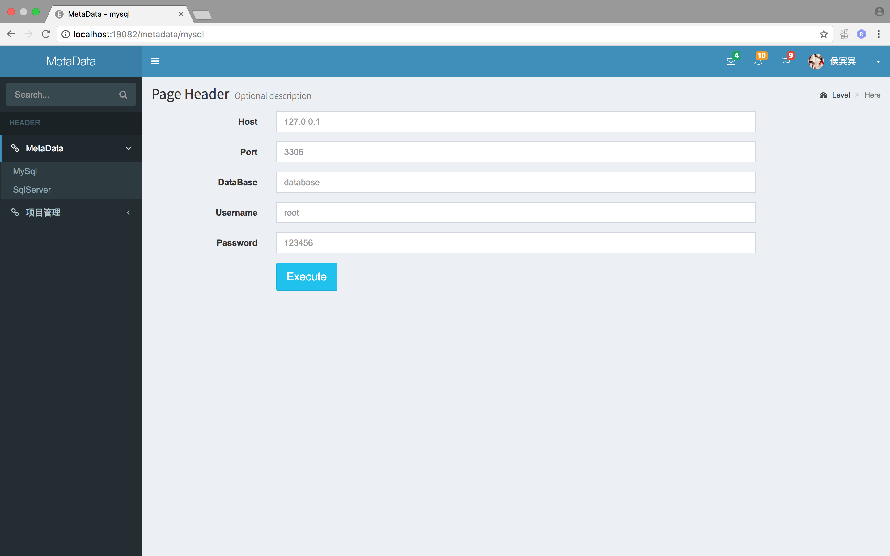

# MetaData

元数据。用于为数据库提供两张表。 meta_field, meta_model

- meta_model

用于存放所有的表信息。(包含元数据表)

- meta_field

用于存放所有的表字段信息。(包含元数据表)

作用：可以自动将所有的表信息和字段信息存入对应的表中。(注释需要保证库本身已经包含了对于表和字段的注释)

# 支持数据库

1. mysql （√）

2. sql server（√）

3. oracle

4. mongodb

数据库的种类繁多，不胜枚举。应该为每一个数据库提供好可覆写的方法。脚本分类提前留好地方。

不同的数据库脚本是不同的。可以使用 powerDesigner 进行统一生成设计。(mac DbWrench Database)

# 表结构的设计

见脚本

- data_table

- data_field

# 文档说明

## maven

(本项目依赖于maven)
本地部署好 maven

```
$   mvn clean install
```

## tomcat

将 war 部署到 tomcat 下运行，或者 

运行 `metadata-web` 下的 tomcat7 插件。

浏览器打开 [http://localhost:18082/](http://localhost:18082/)


# 使用方式

## MySql 使用方式


在 mysql 页面输入数据库的指定数据库链接信息，点击 【Execute】按钮即可。

 
| 属性| 描述 | 默认值 |
|:----|:----|:----|
| Host        | 地址              | localhost | 
| Port        | 端口号             | 3306 | 
| DataBase    | 数据库名称   | |
| Username    | 用户名称 | root |
| Password    | 密码 | 123456 |




## SQL Server 的使用方式


和上面类似。

